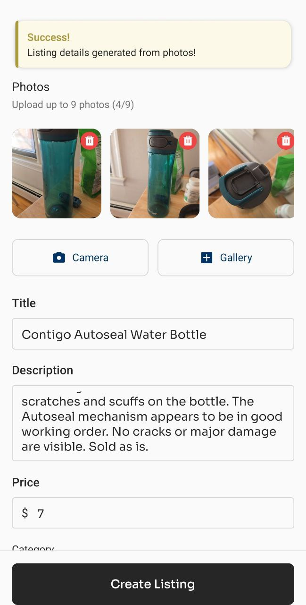
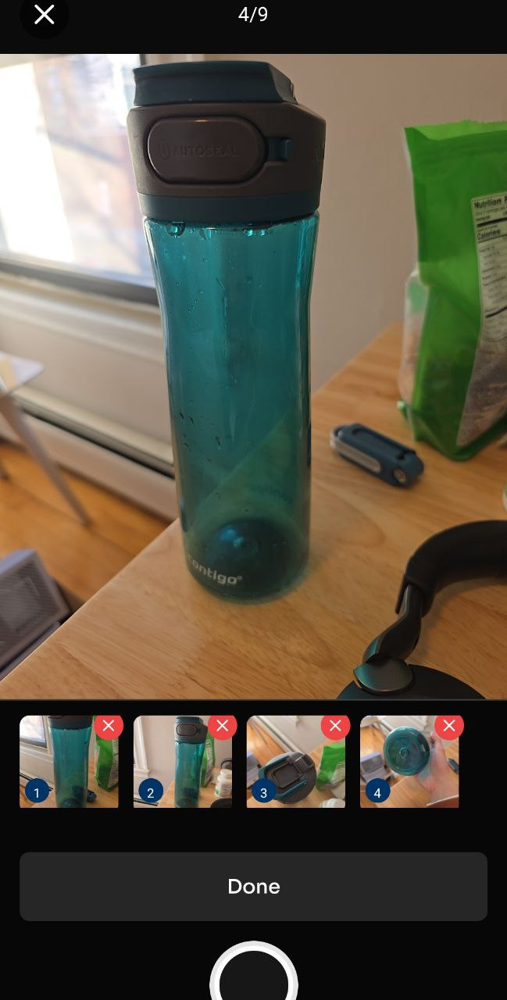
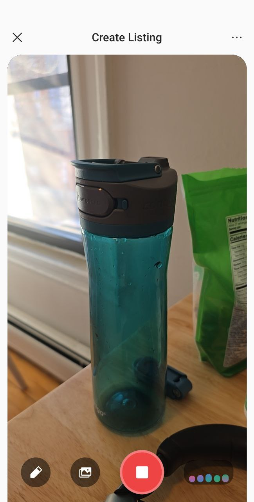

<picture>
  <source media="(prefers-color-scheme: dark)" srcset="./static/darkmode.png">
  <source media="(prefers-color-scheme: light)" srcset="./static/lightmode.png">
  
</picture>

## The Challenge

Build the best ecommerce tool you can with Nano Banana Pro and Gemini 3 Pro. You
have 24 hours.

**What you're working with:**

Nano Banana Pro is Google's new image generation model built on Gemini 3 Pro.
It's designed for commercial use—product photography, background replacement,
virtual try-on, marketing materials. It outputs up to 4K resolution and handles
text in multiple languages.

Gemini 3 Pro is Google's most advanced reasoning model. It's multimodal (text,
images, video, audio, code), has a 1M token context window, and excels at
complex reasoning and agentic tasks.

**Getting Access:**

1. **Set up your Google Cloud billing account**
   - Go to [Google AI Studio](https://aistudio.google.com) or
     [Vertex AI](https://console.cloud.google.com/vertex-ai)
   - Create or link a Google Cloud project
   - Enable billing (credit card required)

2. **Apply your $100 GCP credit**
   - Each team receives $100 in GCP credits
   - Credits will be distributed at the start of the hackathon
   - This covers approximately 745 2K images or 416 4K images

**Pricing:**

- 2K image: $0.134 each
- 4K image: $0.24 each

**Resources:**

- [Nano Banana Pro Documentation](https://ai.google.dev/gemini-api/docs/image-generation)
- [Gemini API Docs](https://ai.google.dev/gemini-api/docs)
- [Google Cloud Billing Setup](https://docs.cloud.google.com/billing/docs/how-to/create-billing-account)

**What we're looking for:**

1. **Solves a real problem** - Does this address something ecommerce businesses
   actually struggle with?
2. **Works well** - Is the execution solid? Does it deliver on what it promises?
3. **Creative use of the tools** - Are you using Nano Banana Pro and Gemini 3
   Pro in interesting ways?
4. **Glitz, glam, gl-polished user interfaces** ✨ - Because it's ecommerce, we
   ascribe a lot of value to excellent user experience. An obvious idea,
   executed extraordinarily well, in a useful/novel form factor ≥ an ambitious
   idea that leaves a lot to the imagination.

**A note on obvious ideas:**

Virtual try-on, background replacement, and basic product photography tools are
the most straightforward applications of Nano Banana Pro. If you're building one
of these, you're competing against what everyone else will think of first. To
win with an obvious idea, your execution needs to be exceptional—not just
functional, but genuinely better than existing solutions. We're looking for
creativity.

Here are the other obvious ones:

**Image generation:**

- Virtual try-on
- Background replacement
- Product photography
- Marketing visuals/ad creative

**Text/chat:**

- Customer service/product guidance chatbot
- Product description generator
- Marketing copy writer
- Review summarizer

Maybe also:

- Visual search (upload image, find similar products)
- Size recommendation tool

You might make one of these more interesting by:

- Combining two or more obvious ideas into a unified experience, e.g. E2E rich
  marketing campaign generator, deep research for product reviews
- Putting one of these in an interesting form factor, e.g. iOS App Clip, Apple
  TV app, Web Component, PoS/kiosk

**What you need to deliver:**

- **GitHub repo with your code** - Fork this repository and fill out the
  submission template below with your project details
- **Live demo** - Hosted URL or demo video showcasing your tool in action
- **Presentation** - You'll present your project to the group at the end of the
  24 hours (5-7 minutes)

---

## Your Submission

**Delete the challenge brief above and fill out the sections below:**

### Team Name

R/N

### Team Members

- Nick Sng
- Rafael Mendiola

### Demo

- **Live URL:** [your-app.vercel.app or similar]
- **Demo Video:** https://youtube.com/shorts/crz0Bg6_IWM?si=ceVWdUk61rp3Sciv

### What We Built

An AI-powered campus marketplace mobile app that revolutionizes how students buy
and sell items. Users can create product listings by simply recording a video of
their item and talking to an AI assistant, which automatically extracts product
details, generates professional studio photos, and creates listings. The app
features semantic search powered by RAG to help users find products by meaning
rather than keywords, and includes an intelligent chat assistant for product
recommendations.

### How It Works

The app uses **Gemini Live API** for voice-first listing creation: users record
video while describing their product, and the AI analyzes frames and audio to
extract details through interactive Q&A. **Gemini 3 Pro
(gemini-3-pro-image-preview)** generates professional product images in two
ways: (1) background removal and studio photo generation from a single camera
shot, and (2) a 3x3 storyboard panel combining multiple video frames into a
comprehensive product sheet. **Gemini 2.0 Flash** powers the chat assistant with
function calling for product recommendations. The backend uses **Convex** for
real-time data sync and **Convex RAG Component** with Gemini embeddings
(`text-embedding-004`) for semantic product search. The architecture is fully
serverless with React Native/Expo frontend, Clerk for authentication, and all AI
processing handled server-side via Convex actions.

### Key Features

- **Voice-First Listing Creation**: Record video and let AI extract product
  details automatically through natural conversation
- **AI-Generated Product Images**: Professional studio photos and 3x3 product
  panels generated using Gemini 3 Pro image generation
- **Semantic Search**: Find products by meaning, not just keywords, using
  RAG-powered vector embeddings
- **AI Chat Assistant**: Conversational interface for product recommendations
  and marketplace queries
- **Real-Time Messaging**: Direct communication between buyers and sellers with
  live updates
- **Campus Marketplace**: Organized by category with campus-specific filtering

### Tech Stack

- **Frontend:** React Native 0.81.5, Expo 54.0.27, TypeScript, Expo Router
- **Backend:** Convex (serverless backend & real-time database)
- **Authentication:** Clerk
- **Models:** Gemini 3 Pro (gemini-3-pro-image-preview), Gemini 2.0 Flash,
  Gemini Live API, text-embedding-004
- **Other:** Convex Agent Component, Convex RAG Component, Zustand (state
  management), React Navigation

### Setup Instructions

```bash
# Navigate to the app directory
cd ecomm-app

# Install dependencies
pnpm install

# Set up environment variables in .env.local
# EXPO_PUBLIC_CLERK_PUBLISHABLE_KEY=your_key
# EXPO_PUBLIC_CONVEX_URL=your_convex_url

# Configure Convex and set Gemini API key
npx convex dev
npx convex env set GEMINI_API_KEY "your_gemini_api_key"

# Start the development server
pnpm run start
```

### Screenshots








### Challenges We Faced

Our biggest challenge was integrating Gemini Live API with React Native's audio
processing constraints. React Native lacks native support for real-time audio
streaming, requiring us to use multiple audio libraries
(`react-native-live-audio-stream`, `react-native-audio-api`,
`react-native-worklets`) and work around platform-specific limitations. We had
to implement custom audio worklets and PCM audio stream handlers to capture and
process audio in real-time, dealing with sample rate mismatches, buffer
management, and WebSocket connection stability. The audio processing pipeline
required extensive debugging across iOS and Android platforms, with different
behaviors on each. Generating high-quality product images with consistent white
backgrounds using Gemini 3 Pro required extensive prompt engineering and
iteration. Implementing semantic search with RAG required careful embedding
management and vector similarity search optimization. Coordinating multiple AI
model calls (Live API, image generation, embeddings) while maintaining good UX
and performance was challenging.

### What's Next

Making the realtime video-first method of creating listings more reliable and
able to process multiple images with different angles at once, as well as draw
bounding boxes to provide realtime feedback that the LLM correctly understood
which product the user is referring to. Enhanced image generation with more
sophisticated prompts for different product categories, improved voice
recognition accuracy for product details, expanded semantic search capabilities
with filters and sorting, push notifications for messages and favorites, and
analytics dashboard for sellers to track listing performance.
